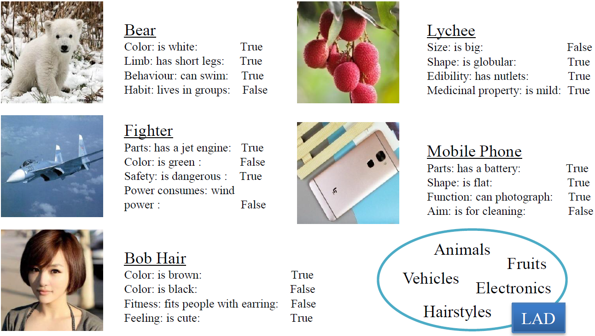

# Zero-shot-Learning
This is a display page of our works on Zero-shot Learning. <br>
Contact: Bo Zhao (bozhaonanjing at Gmail)

Overall, we illustrate 4 papers including an attribute dataset, namely, <br>
[1] Zero-shot learning posed as a missing data problem, <br>
[2] A Large-scale Attribute Dataset for Zero-shot Learning, <br>
[3] MSplit LBI: Realizing Feature Selection and Dense Estimation Simultaneously in Few-shot and Zero-shot Learning, <br>
[4] Zero-shot Learning via Recurrent Knowledge Transfer. <br><br>


## [1] Zero-shot learning posed as a missing data problem <br>
This paper presents a method of zero-shot learning (ZSL) which poses ZSL as the missing data problem, rather than the missing label problem. Specifically, most existing ZSL methods focus on learning mapping functions from the image feature space to the label embedding space. Whereas, the proposed method explores a simple yet effective transductive framework in the reverse way – our method estimates data distribution of unseen classes in the image feature space by transferring knowledge from the label embedding space. Following the transductive setting, we leverage unlabeled data to refine the initial estimation. In experiments, our method achieves the highest classification accuracies on two popular datasets, namely, 96.00% on AwA and 60.24% on CUB.

[Paper Download](http://openaccess.thecvf.com/content_ICCV_2017_workshops/papers/w38/Zhao_Zero-Shot_Learning_Posed_ICCV_2017_paper.pdf)<br>
Code: [Python](https://github.com/AIChallenger/AI_Challenger_2018/tree/master/Baselines/zero_shot_learning_baseline),
[Matlab](https://github.com/PatrickZH/Zero-Shot-Learning-Posed-as-a-Missing-Data-Problem)


Citation <br>
```
@inproceedings{zhao2017zero,
  title={Zero-shot learning posed as a missing data problem},
  author={Zhao, Bo and Wu, Botong and Wu, Tianfu and Wang, Yizhou},
  booktitle={Computer Vision Workshop (ICCVW), 2017 IEEE International Conference on},
  pages={2616--2622},
  year={2017},
  organization={IEEE}
}
```

## [2] A Large-scale Attribute Dataset for Zero-shot Learning <br>
Previous ZSL algorithms are tested on several benchmark datasets annotated with attributes. However, these datasets are defective in terms of the image distribution and attribute diversity. In addition, we argue that the “co-occurrence bias problem” of existing datasets, which is caused by the biased co-occurrence of objects, significantly hinders models from correctly learning the concept. To overcome these problems, we propose a Large-scale Attribute Dataset (LAD). Our dataset has 78,017 images of 5 super-classes, 230 classes. The image number of LAD is larger than the sum of the four most popular attribute datasets. 359 attributes of visual, semantic and subjective properties are defined and annotated in instance-level. We analyze our dataset by conducting both supervised learning and zero-shot learning tasks. Seven state-of-the-art ZSL algorithms are tested on this new dataset. The experimental results reveal the challenge of implementing zero-shot learning on our dataset. <br>
A competition was held based on this dataset. <br>

[Paper Download](https://arxiv.org/pdf/1804.04314v2.pdf)<br>
Data Download from [Google Drive](https://drive.google.com/open?id=1WU2dld1rt5ajWaZqY3YLwLp-6USeQiVG),
from [BaiduYun](https://pan.baidu.com/s/1QpUpNLnUAOK1vhg5Di0qUQ), Password: cwju <br>
[AI Challenger - Zero-shot Learning Competition](https://challenger.ai/competition/zsl2018) <br>
[Baseline Code](https://github.com/AIChallenger/AI_Challenger_2018/tree/master/Baselines/zero_shot_learning_baseline)



Citation <br>
```
@article{zhao2018large,
  title={A Large-scale Attribute Dataset for Zero-shot Learning},
  author={Zhao, Bo and Fu, Yanwei and Liang, Rui and Wu, Jiahong and Wang, Yonggang and Wang, Yizhou},
  journal={arXiv preprint arXiv:1804.04314},
  year={2018}
}
```

## [3] MSplit LBI: Realizing Feature Selection and Dense Estimation Simultaneously in Few-shot and Zero-shot Learning <br>
It is one typical and general topic of learning a good embedding model to efficiently learn the representation coefficients between two spaces/subspaces. To solve this task, L1 regularization is widely used for the pursuit of feature selection and avoiding overfitting, and yet the sparse estimation of features in L1 regularization may cause the underfitting of training data. L2 regularization is also frequently used, but it is a biased estimator. In this paper, we propose the idea that the features consist of three orthogonal parts, namely sparse strong signals, dense weak signals and random noise, in which both strong and weak signals contribute to the fitting of data. To facilitate such novel decomposition, MSplit LBI is for the first time proposed to realize feature selection and dense estimation simultaneously. We provide theoretical and simulational verification that our method exceeds L1 and L2 regularization, and extensive experimental results show that our method achieves state-of-the-art performance in the few-shot and zero-shot learning. <br>
We also visualize the strong and weak signals (i.e. the strongly and weakly related classes) in zero-shot learning experiments.

[Paper Download](https://arxiv.org/pdf/1806.04360.pdf)<br>
[Code](https://github.com/PatrickZH/MSplitLBI)


Citation <br>
```
@article{zhao2018msplit,
  title={MSplit LBI: Realizing Feature Selection and Dense Estimation Simultaneously in Few-shot and Zero-shot Learning},
  author={Zhao, Bo and Sun, Xinwei and Fu, Yanwei and Yao, Yuan and Wang, Yizhou},
  journal={Proceedings of the 35th International Conference on Machine Learning},
  year={2018}
}
```

## [4] Zero-shot Learning via Recurrent Knowledge Transfer <br>
Recently, many works implement zero-shot learning by transferring structural knowledge from the semantic embedding space to the image feature space. However, we observe that such direct knowledge transfer may suffer from the space shift problem in the form of the inconsistency of geometric structures in the training and testing spaces. To alleviate this problem, we propose a novel method which actualizes recurrent knowledge transfer (RecKT) between the two spaces. Specifically, we unite the two spaces into the joint embedding space in which unseen image data are missing. The proposed method provides a synthesis-refinement mechanism to learn the shared subspace structure (SSS) and synthesize missing data simultaneously in the joint embedding space. The synthesized unseen image data are utilized to construct the classifier for unseen classes. Experimental results show that our method outperforms the state-of-the-art on three popular datasets. The ablation experiment and visualization of the learning process illustrate how our method can alleviate the space shift problem. By product, our method provides a perspective to interpret the ZSL performance by implementing subspace clustering on the learned SSS.  <br>
[Paper Download](https://drive.google.com/open?id=1cUsQWX80zeCxTyVSCcYlqEWZP-Hq0KzR)<br>
Code: Coming Soon


Citation <br>
```
@article{,
  title={Zero-shot Learning via Recurrent Knowledge Transfer},
  author={Zhao, Bo and Sun, Xinwei and Hong, Xiaopeng and Yao, Yuan and Wang, Yizhou},
  journal={Proceedings of IEEE Winter Conf. on Applications of Computer Vision (WACV)},
  year={2019}
}
```
